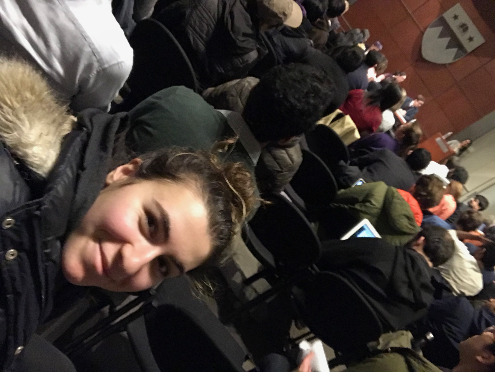
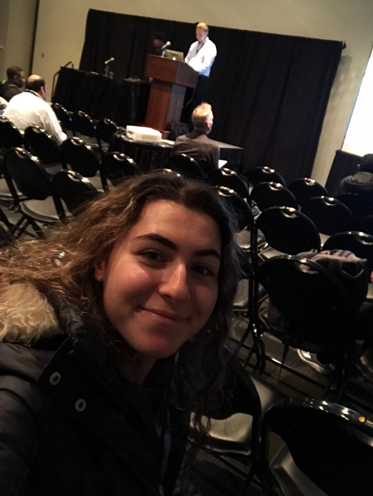

## NYC Open Data Week

#### Event 1: BUGS event at NYU

The event was hosted by BUGS and featured three guest speakers on a panel for the first hour, and then allows students to walk around and see projects that made use of open data. There were three guest speakers: a data science librarian that worked at NYU, a lawyer for NYC, and another lawyer. They were asked questions by a host and each offered their own take on open data. I liked that you got to hear people from different professions and how open data is extremely helpful and can make such a big difference in people's lives. One big thing that I learned or was made aware of was how easy it was for open data to be misused and used for negative purposes. One example was brought up that there was data of Taxi drivers' religious preferences which was then used for negative purposes. But open data can also bring important issues to light, such as the example in Brazil where female inmates were only being given two pads each year.

#### Event 2: Oracle event at Javits Center- Maximizing the Value of Municipal Open Data APIs with Low Code Development Tools

The event was hosted by Oracle at the Javits Center. The speaker of the event was Marc Sewtz, who used several open data sets from the NYC website. He used the data sets to demonstrate how to build applications on open data APIs. He also discussed municipal data and how making it publicly available can let local governments more accountable to the communities they serve. I liked the event but felt that it was more of an opportunity to show off Oracle's new cloud based tools. 

